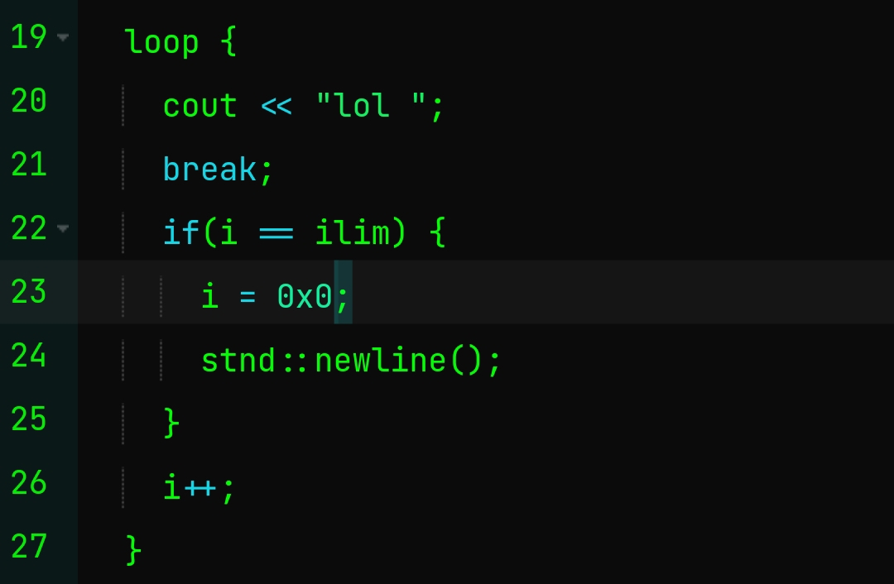
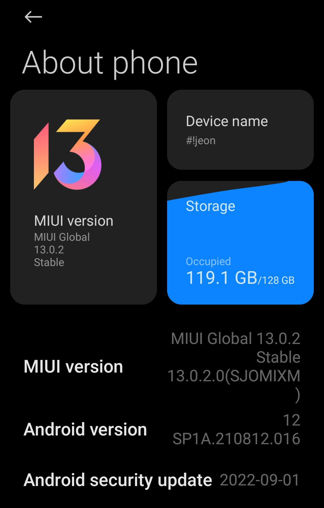

<h1 align="center">Oa 🗿, soy Jeon (o Winter, los dos soy yo.)</h1>
<h3 align="center">Un programador aficionado del borde de la nada. (Michoacán, México)</h3>

- 🇨🇳 Captura inútil de una función.

- Captura y specs de mi setup.

  Sí..., no era broma, programo desde mi teléfono)

- Specs completas:
 + OS: Android 12 aarch64
 + UX: MIUI 13
 + Chipset: Mediatek Helio G85 @ 12nm
 + Procesador: Octacore (2x Cortex-A75 @ 2GHz / 6x Cortex-A55 @ 1.8GHz)
 + GPU: Mali-G52 MC2
 + Pantalla: 6.53" 1080x2340px
 + Storage: Algunamarca eMMC v5.1 128GB (~118GB usables)
 + RAM: Algunamarca xmodelo 4GB LPDDR4 @???MHz
- Notas:
  + Antes de MIUI 13 (MIUI 12.5//11):
    * Buen teléfono, por el precio no está tan mal.
  + Después de MIUI 13:
    * Ptm, o la actualización es una por*nga, o el teléfono es una por#nga, porque ptm que infumable está el rendimiento.
    * Este teléfono es una joya, dos años de uso, una actualización horriblemente asquerosa, un manejo de memoria peor que abobinable, y sigue vivo.

- 🔭 Estoy trabajando en: [newstd (una nueva librería inútil remplazo del estándar en C++)](https://github.com/mxjeonsg/newstd)

- 🌱 Estoy aprendiendo: **C y C++. XD**

- 🗿 Estoy buscando colaborar en: [Reconstrucción del Mamita's Puebla](<none>)

- 🤝 Quisiera ayuda con: [Saberle al C.](<no>)

- 👨‍💻 Todos mis proyectos están en:[https://github.com/mxjeonsg](https://github.com/mxjeonsg)

- 💬 Pregúntame de: **Tipos primitivos de C, es todo lo que sé.**

- 📫 Como contactarme:
- **akjeon0@gmail.com**

- 📄 Una de mis experiencias: [Seguido causo Segmentation fault, juego con los punteros como si fueran juguetes.]

- ⚡ Sección **Acerca de mí** que nadie pidió:
  + **Hablo cero Inglés**
  + **Estoy aprendiendo Chino y Ruso.**
  + **Tengo 18 años xdd**
  + **Soy Mexicano, y mi estado no se ve sepia, qué decepción.**
  + **Me gusta C, y no sé si quiero aprender Rust o Go, quizás lo haga para comer.**
  + **Hago conlangs, sis.**
  + **Soy fan de la sandía para siempre.**

<h3 align="left">Contáctame:</h3>

  - Instagram: <a href="https://instagram.com/@mxjeonsg">lol</a>
  

  - Toxicidad.com: <a href="https://www.twitter.com/@mxjeonsh">lol again</a
  

  - Telegram: <a href="t.me/mxjeonsg">lol</a>
  

  - E-Mail (Yandex): [mxjeonsg@yandex.com]
  

  - E-Mail (Google): [akjeon0@gmail.com]

<h3 align="left">Lenguajes y herramientas:</h3>

    

<!---
jeonjsj/jeonjsj is a ✨ special ✨ repository because its `README.md` (this file) appears on your GitHub profile.
You can click the Preview link to take a look at your changes.
---!>
